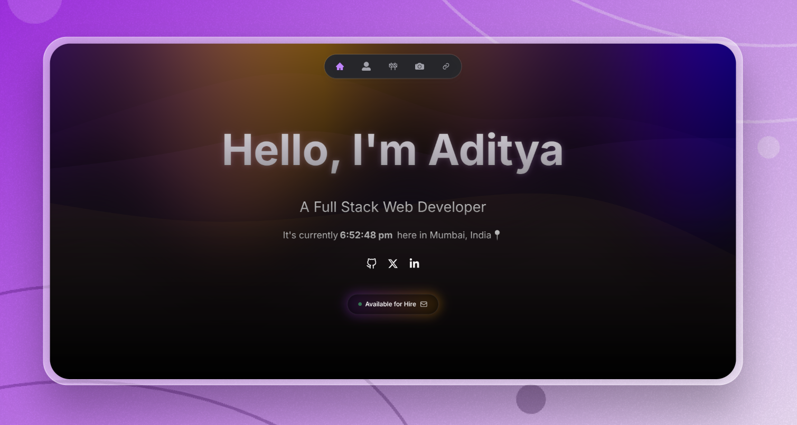

<h1 align="center"> Aditya Joshi's Portfolio. </h1>

  

Welcome to my portfolio repository! 🚀 Here you can explore the code behind my portfolio website.

## 🌟 Live Website: [Check it out here!](https://adityaj07-portfolio.vercel.app/)

### Technologies used: 
My website leverages the power of various technologies: 

#### Extras
- [Nodemailer](https://nodemailer.com/)

### Get in Touch
Have feedback, questions, or just want to say hi? Feel free to reach out to through the [contact form](https://adityaj07-portfolio.vercel.app/contact) on my portfolio website.

#### Thank you for visiting this repository! Don't forget to star ⭐️ this project if you found it interesting or useful!